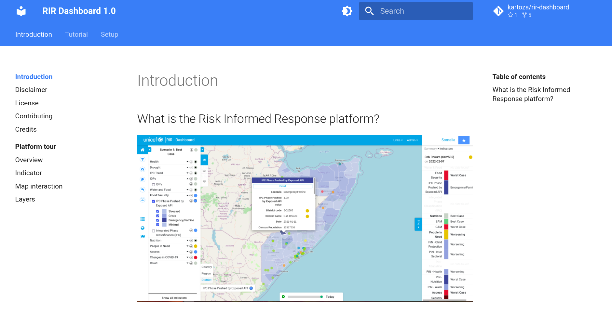
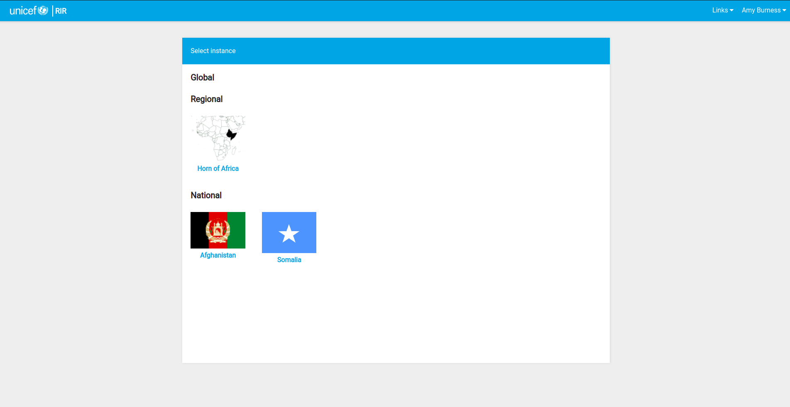
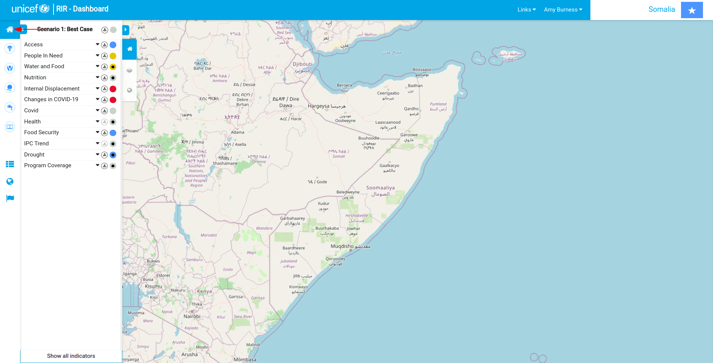
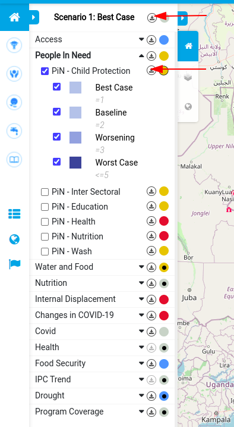
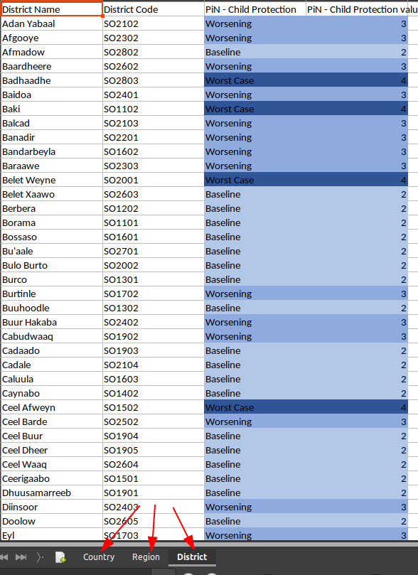
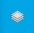
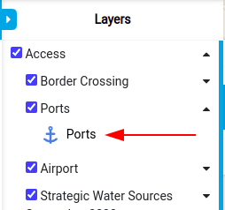

# User Tutorial

> RIR: Risk-Informed Response

🧑‍🏫 The RIR platform is a situational awareness platform to monitor health, child protection, nutrition, water, sanitation, hygiene, and education in a geographic region. This section will explain how the RIR platform works to fully understand the platform and the information you can obtain from it.

## Working with this documentation

Whenever you see a phrase in **bold**, it refers to a link or button on the user interface that you can interact with.

## Session outline 

This session will tour the RIR platform functionality using simple examples and workflows that the everyday platform user would use.

### Important Links:

* [RIR Platform](https://staging.rir.kartoza.com/ "RIR Platform")
* [RIR Full Documentation](https://kartoza.github.io/rir-dashboard/ "RIR Full Documentation")

### Session Outline: 

We will show you how to navigate the platform and summarise what each tool and button does during this tutorial. We will include simple examples and workflows.

1. Access the platform
2. **Documentation** and **Links**
3. **Instances**
4. **Sign in**
5. The Dashboard tour (See also [Indicators](https://kartoza.github.io/rir-dashboard/pages/using/indicators.html#indicators)):
     * **The Context Analysis Button**
     * **Programme Interventions Panel**
     * **The Indicator Panel** 
     * **Hiding and showing panels**
     * **The Traffic Light**
     * **The Information Panel**
     * **Downloading Data button**
6. Layers (see also [Layers](https://kartoza.github.io/rir-dashboard/pages/using/layers.html#layers)):
     * The **Context Layers Icon** 
     * The **Basemap Icon**
     * **Geography Level Panel**
7. Map Interactions (see also [Map Interactions](https://kartoza.github.io/rir-dashboard/pages/using/map_interactions.html)):
     * **Panning**
     * **Zooming**
     * **Information Display Popup** 
     * **The Map Slider** 
     * **Timelapse Bar**
8. More on the **Information Panel**
     * **Graphical Representation**
9. Questions 

You can find more self-study content in the full system documentation here: [Platform Tour](https://kartoza.github.io/rir-dashboard/pages/using/platform_tour.html)).

## Tutorial

### Accessing the platform

You can access the platform here: https://staging.rir.kartoza.com: 

> 📒 **Note** this link will change in the future. We will advise all users of the system when that happens.

### Documentation

🧑‍🏫 On the top right-hand side of the landing screen, there is a drop-down menu for **Links** and a link to a sign-in page. The **Links** drop-down menu is a quick way to access the documentation for the platform. 

> 📒 **Instructor note:** Briefly show the documentation and how to navigate it.

### Instances

🧑‍🏫 On the landing page, you will see several **Instances**. An **Instance** is a configured dashboard for a specific region or country. We will use the **Somalia instance** for the examples in this tutorial.

### Signing In

🧑‍🏫 Return to the RIR platform, click on the **Sign In** link, and a page will open where you can add your user name and password. Your credentials are created for you by an administrator.

🧑‍🏫 **Sign In** is important to access all the platform's functionality. Your name will appear on the top right once signed in. Depending on your admin privileges, there will be a drop-down menu to log out. 

### The Somalia Dashboard

👩‍💼 Click on the **Instance** labeled Somalia, and the dashboard will load and open. 

## Dashboard Tour

🧑‍🏫 Let's tour the dashboard together. We will start from left to right across the screen, showing what each button and panel does with a few simple examples. See the summary of the dashboard tools below. 

### The Context Analysis Button

🧑‍🏫 At the top left of the screen, you will see the **Context Analysis Button**.

 

This button gives access to the **Indicator Panel**. 

🧑‍🏫 Below the **Context Analysis Button** is the **Programme Interventions Panel**. It contains a set of buttons that allow access to key risk response indicators. 

👩‍💼 Click on the arrow next to the house symbol. The tabs will extend and be labeled to see what each symbol means, Health, Child Protection, Nutrition, Wash, and Education.

🧑‍🏫 For example, the second button-down with a picture of the caduceus/medical symbol indicates **Health**. Click on the **Health** button, and a report will open on the status of the scenario for each indicator.
 
👩‍💼 Click on each button to see the information for each factor. 

### The Indicator Panel

👩‍💼 Click back on the **Context Analysis Button** and observe the **Indicator Panel**. 

🧑‍🏫 This panel contains a list of **Indicators** (special layers) that relate to the main factors of interest on the platform, like health and nutrition.

For example, in Somalia, there are indicators for Children in need of protection **PIN- Child Protection** that we will practically explore below. 

The **Indicator** panel is expanded by default. Click on the tab labeled with a house on the right side of the panel to minimize the indicator panel. Collapsing the pannel can allow you to observe the map better.

👩‍💼 Click on the triangle next to the label **People In Need**. 

🧑‍🏫 This will expand the section showing all the data available on different groups of people that require assistance from the government or other organizations.

👩‍💼 check the box next to **PIN- Child Protection**.

🧑‍🏫 A tick will appear in the check box, and a layer will appear on the map. The map shows the degree of child protection priority in darkening shades of blue. 

You can filter the scenarios by checking or unchecking the boxes next to each scenario (e.g., best-case or worst-case) for the **indicator**. 

👩‍💼 Click and unclick the different case options (see how the map changes). Ensure all of the **PIN- Child Protection** sub-Layers are ticked to continue with the tutorial.

🧑‍🏫 When an indicator is selected, an **Information panel** will open on the right-hand side of the screen. We will go through the **Information Panel** in more detail shortly. 

🧑‍🏫 The colored circles next to each **indicator** show the current scenario for that indicator. The circle at the top indicates the global scenario level. 

Grey indicates the best-case scenario, blue is the status Quo/Baseline, yellow shows a worsening case, and red indicates the worst case. The scenario color shows if the **Indicator** overall requires additional interventions.

### The Traffic Lights

🧑‍🏫 You can access what we call traffic lights for the indicators by clicking on the arrow in the top right of the **Indicator panel**. This will expand the information. 

For example, for our selected layer **PIN- Child Protection**, the situation is worsening for children hence the yellow color. Thus, several regions need additional responses or support to protect vulnerable children. Click the triangle (now on the top right) to see the map again. 

### The Information Panel

🧑‍🏫 On the right-hand side of the screen, the **Information Panel** shows a summary of the indicator selected, broken down by region or district. At the top of the **Information Panel**, there are different drill-down levels of information on the chosen indicator, the first being **Summary**. 

In the summary level, you can see that in Adan Yabaal Child protection has a value of 3. You will also see an interactive **pie chart** summarising all the data for the indicator. Hover your mouse over the **pie chart** and observe the labels and number of districts in Worsening and Worst Case scenarios.

🧑‍🏫 Click on the region named Adan Yabaal (the text) in the **Information Panel**. The platform will show where the region is on the map with an information popup. 

The **Information Panel** will drill down to the next level of information **Indicators**. The panel will now show all the indicators for the specified region. It also shows the severity of the indicator using the different traffic light colors.

You can click on the indicator to drill down further to the detail. Click on **PiN-Child Protection** (the text), and you will see more information and a simple infographic/timeline on the current scenario. 

We will look at the **Information Panel** with different data further on in this tutorial and show how the simple infographic in the detail section can show changes over time if the data has such information. 

### Downloading Data Button

🧑‍🏫 You can download any data of interest by clicking on the round symbol with the download arrow (**download button**) next to each indicator in the **Indicator Panel** for the selected indicator.
You can get all the data for the Instance if you click **the download button** at the top of the **Information Panel**. This will give you a spreadsheet of the information that you can use outside of the platform. 

👩‍💼 
 Click on the **download button** next to **People In Need** and observe the downloaded spreadsheet on your computer. Note the data is color-coded in the spreadsheet as per the platform and the data is broken down into tabs for each geography level. Thus, you can work with the data offline.

## Layers

🧑‍🏫 Let's explore **Context layers**. Layers that give context to the indicators on the map and include **Context layers**, **Base Maps** and **Geography levels**

### Context Layers

🧑‍🏫 The **context layers** can be accessed by clicking on the button with 3 overlapping squares on it.

 

There will be a list of layers to choose from. **Context layers** are shown on the map to provide a sense of the conditions in the region. They can cover any topic. For example, security, food security, infrastructure, etc. **Context layers** do not have indicator data attached. They are a visual aid on the dashboard map.

Let's select 'Access'. We can now see all the roads, airports, and other access indicators/features. 

Click on the triangle next to **Access** to expand the options/group. You can choose exactly what features you want to see. Turn off everything except **Roads** and **Ports** by checking and unchecking the checkboxes. 

You can access the **legend** of the **Context layers** by expanding the triangle next to the **Access** features (e.g., Ports).

Click on a point on the map like a port. You will be given information about the point in an **Information Popup**. 

### Base Maps

🧑‍🏫 You can change the base map behind the data if you click on the world icon in the panel. 

 

The default is an OpenStreetMap. There is also a GEBCO grid base map which is a global terrain model for ocean and land, a Mapbox satellite base map, and an Open Topo base map which is rendered from OSM and SRTM data.

🧑‍🏫 For example, it may be useful to have a topographic map to visualize geographic features like mountains and rivers that could impede people's movement into areas if you review people's internal displacement. 

👩‍💼  
* Turn on the Open **Topo Map**.
* Navigate back to the **Indicator Panel**.
* Uncheck the child protection layer. 
* Expand the group for **Internal Displacement**
* Select the **IDP Departure Indicator**

🧑‍🏫 You can now see some of the topographic features underneath the departures layer. You may observe that several areas with high departure rates are in the northern desert area. Thus, drought may be affecting the people in these cases.

Let's take it a step further. Go to the **Context layers**, expand the **Natural Hazard** options, and check on the **Drought Priority Areas**. You can see that many of the drought priority areas are in the northern desert area. 

Ensure to uncheck the **Drought Priority Areas** and the **Access layers** to continue with this tutorial. 

### Geography Levels

🧑‍🏫 While we have the IDP data handy, let's change the **Geography Level** of the indicators. 

Geography levels express the hierarchy between administrative boundaries. For example, in Somalia, we have the country boundary subdivided into regions, which are in turn subdivided into districts. RIR uses these geography levels to provide a sense of the conditions at different geographic scales.

* On the selector at the bottom right of the map, select Region, and you will see that the geographic level of the areas changes. 
* Click on Country and see what happens. 

## Map Interactions

🧑‍🏫 Let's now get into interacting with the Map. Below is a summary of all the map interactions available.

Check on the **PIN- Child Protection** and check off the **IDP Departure layer**

### Zooming

🧑‍🏫 Zoom into and out of the map by using the scroll wheel on your mouse. Alternatively, hold down shift, click your mouse and draw a square around the area you wish to zoom in to. 

### Panning

To pan on the map, click and hold on the map and drag it around.

### Information Popup

Once you have zoomed and panned to an area of interest, click on it, and you will see an information popup as we saw earlier. For more information, click on the detail button, and information will be shown in the **Information Panel** on the right. Click off the map popup to get out or press exit.

### The Slider

🧑‍🏫 The slider allows us to compare two indicators on the map. For example, while child protection is selected, let's see where there is program coverage for child protection in Somalia. 

Under the **Program Coverage** indicator select the **Child Protection** option. You will see a slider appear and the layer names represented on each side on the bottom left and right of the map. Further, a split summary of each selected layer will be shown in the **Information Panel** at the summary level. 

If you click on the slider grab handle and drag from side to side, you can see that in several of the regions in the north with the worst-case scenario for child protection, there are no active programs to combat the issue. These would be ideal candidates to fund child-relief projection. 

You can make the slider horizontal by clicking the map button at the bottom right of the map canvas.

### Timelapse Bar

There is a **Timelapse Bar** that can show changes in data over time. It is located at the bottom center of the screen or map area. 

A great use case is the internal displacement of people. Turn off both child protection indicators and activate the **IDP Departure layer**. 

You can see where indicators are selected because the tab heading will be in bold. Click the **play button** on the time bar. You will see the changes in what region people are leaving over time. 

> Note: It may take some time to initially load the timelapse. 

Turn off the **play button** to stop the timelapse. You can click and drag on the grab handle in the timelapse bar to manually move it. 

## More on the Information Panel

🧑‍🏫 While the **IDP Departures** is open, let's look at the last options and functionalities on the **Information Panel**. 

You can toggle the visibility of the **Information Panel** by clicking on the blue **info button**. 

Inside the information panel, there is a summary of all the regions or districts. For example, we can see how many people departed each area because we are looking at the departures layer. 

### Graphical Representation

🧑‍🏫 In the **Information Panel**, There is a graphical representation of the scenarios. The **pie chart** shows the proportion of regions in each scenario. You can hover your mouse over the chart and interact with it. For example, it will show 54 out of the 73 districts are in the best-case scenario. 

👨‍🏫 Hover your mouse over the pie chart and observe the labels and number of districts in different scenarios. 

🧑‍🏫 Click on the name Adan Yabaal and in the **Information panel** and the Indicators drill down and select **IDP departure**. 

This will open the detail drill-down panel, where you can see a line graph showing the change over time for the Adan Yabaal district and other pertinent information. 

> Note: the breadcrumb bar at the top of **Information Panel** where you can see where you are in the hierarchy or the drill down.

## Bringing it all together

🧑‍🏫 With your knowledge of the RIR dashboard, let's try an analysis where we look at what districts people are departing from and what districts they are arriving to. 
👩‍💼 
* Set the base map to OpenStreetMap
* Add the context layer **Refugees and IDPs**
* Activate both the arrivals and departures indicator layers
* click on different districts and observe the detail in the information panel
* slide the slider to see if neighboring districts accept departing people, thus having higher arrivals than previously observed (see the linear graphs to compare).

Answer the following questions:
* What regions have the highest number of departures?
* What regions have the highest number of arrivals? 
* What region has had the most changes in departures over time? 

